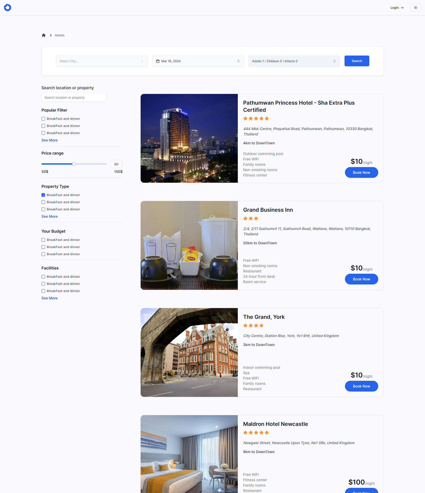

<a name="readme-top"></a>

<!-- PROJECT LOGO  -->
<br />
<div align="center">
  <a href="https://github.com/Elalfy74/hotel-booking">
    
  </a>

  <h3 align="center">Hotel Booking</h3>

  <p align="center">
   A hotel booking app has been developed to enable users to browse and make reservations at various hotels
    <br />
    <br />
    <a href="https://www.youtube.com/watch?v=bciFYmWU3C0">
    View Demo</a>
    ·
    <a href="https://hotel-booking-elalfy74.vercel.app/">
    See Live</a>
  </p>
</div>

<!-- TABLE OF CONTENTS -->
<details>
  <summary>Table of Contents</summary>
  <ol>
    <li>
      <a href="#about-the-project">About The Project</a>
      <ul>
        <li><a href="#built-with">Built With</a></li>
        <li><a href="#features">Features</a>
          <ul>
            <li><a href="#authentication">Authentication</a></li>
            <li><a href="#server">Server</a></li>
            <li><a href="#client">Client</a></li>
            <li><a href="#dashboard">Dashboard</a></li>
          </ul>
        </li>
      </ul>
    </li>
    <li>
      <a href="#getting-started">Getting Started</a>
      <ul>
        <li><a href="#prerequisites">Prerequisites</a></li>
        <li><a href="#installation">Installation</a></li>
      </ul>
    </li>
    <li><a href="#contact">Contact</a></li>
  </ol>
</details>

<!-- ABOUT THE PROJECT -->

## About The Project

[![Hotel Booking][product-screenshot]](https://hotel-booking-elalfy74.vercel.app/)

- This Project is a hotel booking app has been developed to enable users to browse and make reservations at various hotels.
- Data is pulled from popular Hotels Websites.
- Project is built with new nextjs server action technology,and combined mix of ssg, streaming ssr, and csr.
- Project is come with fully featured dashboard.
- Project is fully responsive and support light and dark mode.

<p align="right">(<a href="#readme-top">back to top</a>)</p>

### Built With


<p align="right">(<a href="#readme-top">back to top</a>)</p>

### Features

#### Authentication

The app's authentication system, powered by NextAuth, features multi-role authorization, with distinct roles assigned to users. Specifically, there are two roles: "user" and "admin". The "admin" role grants access to the dashboard, providing privileged functionality within the application.

- Email and Password
- Google
- Github

Example: [Login](https://hotel-booking-elalfy74.vercel.app/login)


#### Server

App is built with server action, so there is no need for an API only utilize Prisma as database ORM.

#### Client

Modern UI and experience.

1. [Home Page](https://hotel-booking-elalfy74.vercel.app)
2. [Countries Page](https://hotel-booking-elalfy74.vercel.app/countries)
3. [Cities of a Country Page](https://hotel-booking-elalfy74.vercel.app/countries/63ee953dad1b700854466fb3)
4. [Hotels Page](https://hotel-booking-elalfy74.vercel.app/hotels)
5. [Single Hotel Page](https://hotel-booking-elalfy74.vercel.app/hotels/63eeadd2ae7050a016ca3bc1)




Responsive design.


<p align="right">(<a href="#readme-top">back to top</a>)</p>

#### Dashboard

Fully featured dashboard let you able to manage your hotels and reservations.
the dashboard consist of different pages which you can access from navigation bar.
Dashboard Tables support pagination, sorting and complex filters.
Utilize [nuqs](https://nuqs.47ng.com/) for URL state management to save state in URL.
You can do CRUD operations on everything with modern UI like steps, Drag and Drop and many more.


<p align="right">(<a href="#readme-top">back to top</a>)</p>
<!-- GETTING STARTED -->

## Getting Started

### Prerequisites

- Node.js
- npm or pnpm
- postgres database

### Installation

1. Clone the repo
   ```sh
   git clone https://github.com/Elalfy74/hotel-booking
   ```
2. Install NPM packages
   ```sh
   pnpm i
   ```
3. Rename 'env.example' to 'env.local'
4. Configure .env Variables
   replace default values with your own
5. Setup Prisma
   ```sh
   npx prisma db push && npx prisma generate
   ```
6. Start the project
   ```sh
   pnpm dev
   ```

<p align="right">(<a href="#readme-top">back to top</a>)</p>

<!-- CONTACT -->

## Contact

Mahmoud Elalfy - [@Mahmoudelalfy74](https://twitter.com/Mahmoudelalfy74) -
[@Portfolio](https://mahmoud-elalfy.vercel.app/) -
[@LinkedIn](https://www.linkedin.com/in/mahmoud-elalfy-79b894209/)

Project Link: [Hotel Booking](https://github.com/Elalfy74/hotel-booking)

<p align="right">(<a href="#readme-top">back to top</a>)</p>

[product-screenshot]: assets/images/screenshot.png
